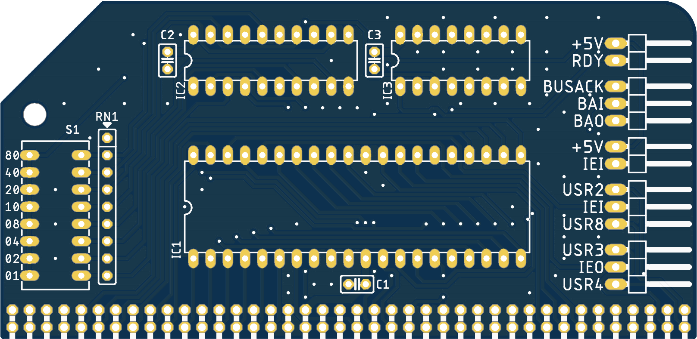

A DMA module designed for the RC2014.

### BOM
- 1x Z84C1008PEG (IC1)
- 1x 74HCT688N (IC2)
- 1x 74LS157N (IC3)
- 1x 2x40 90 degree pin header (JP1)
- 3x 1x3 90 degree pin header (JP2, JP3, JP5)
- 2x 1x2 90 degree pin header (JP4, JP6)
- 3x 100nF 2.54mm ceramic capacitors (C1, C2, C3)
- 1x 10K 8-resistor bussed network (RN1)
- 1x MCNDP-08V 8-way DIP switch (S1)

### Board photos and renders

